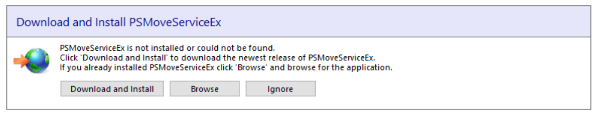
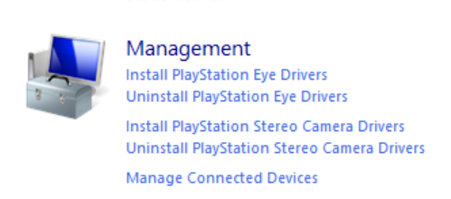

# Tracking
The tracking of the HMD (Head Mountain Display) and controllers are tracked with the same principles as Playstation Move. That is, by using different coloured blobs, and a camera (or multiple cameras) to know where in space each blob is located.

This type of tracking has the advantage of being reasonably cheap, since the blobs can be made out of ping pong balls and common LED's, and the cameras are standard Playstation Eye cameras.

## Why Playstation Eye cameras and not regular webcams?
- Playstation cameras can do up to 60fps at 640x480 which allows for smoother tracking.
- They are low cost and readily available.
- They have known lens distortion values. 
- All Playstation Eye cameras are created equal, which means a camera bought in the America and a camera bought in Europe will run exactly the same.

**(NOTE: You can use webcams by using virtual trackers in VDM)**

# What you'll need
- [PSMoveService VDM](https://github.com/Timocop/PSMoveServiceEx-Virtual-Device-Manager/releases/)
- [PSMS Calibration mat](https://github.com/psmoveservice/PSMoveService/blob/master/misc/calibration/CalibrationMat.pdf), Ideally printed on letter paper, though A4 works fine too (You will get better results printing on a total of 4 papers instead of one.)
- *At least* 2 Playstation Eye cameras (**NOT** EYE TOY).
- USB extensions: you can extend up to 1.8m (6ft) (for a total of 3.6m (12ft)) with passive cables, anything longer you will need to repeat the signal with either a active cable or a USB hub.

## Why a *minimum* of 2 cameras and the amount I recommend.
A single camera results in jittery tracking since you can't do triangulation on a single camera and no redundancy, meaning that the second your tracking blob gets occluded (be it by your body or by something else) you'll lose all tracking.

Two cameras allow for triangulation and, *to some extent* redundancy. This is the bare minimum I'd recommend for vr.

The problem is that the moment one of your blobs gets occluded your tracking will turn into a jittery mess. *This is why I recommend three or four cameras.*

Three cameras not only allows for smoother, more accurate tracking, but it also allows for redundancy and since you only need two cameras for triangulation you can block the tracking blob for one camera entirely and still have decent tracking.

More cameras would allow for more redundancy, you can hook up as many as you want, but keep in mind USB bandwith limitations and processing power overhead. 

Maximum play area I'd say is about 4x4m (~13ft), any more and you'll have issues with your tracking due to the low video quality of these cameras. I'd keep the play area below 3.5x3.5m (~11x11ft).

# Installing the PsMoveServiceEx & Drivers

Plug in all your cameras and open up Device Manager, you'll probably see something similar to this:

Download [PSMoveService VDM](https://github.com/Timocop/PSMoveServiceEx-Virtual-Device-Manager/releases/).
Open, **PSMSVirtualDeviceManager.exe**. Click "Download and Install" button.

Now, install PS Eye camera driver. Under managment click "Install Playstation Eye Driver".

