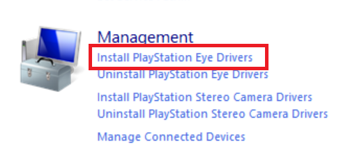

# Tracking
The tracking of the HMD (Head Mountain Display) and controllers are tracked with the same principles as Playstation Move. That is, by using different colored blobs, and a camera (or multiple cameras) to know where in space each blob is located.

This type of tracking has the advantage of being reasonably cheap, since the blobs can be made out of ping pong balls and common LED's, and the cameras are standard Playstation Eye cameras.

## Why Playstation Eye cameras and not regular webcams?
- Playstation cameras can do up to 60fps at 640x480 which allows for smoother tracking.
- They are low cost and readily available.
- They have known lens distortion values. 
- All Playstation Eye cameras are created equal, which means a camera bought in the America and a camera bought in Europe will run exactly the same.

**(NOTE: You can use webcams by using virtual trackers in VDM)**

# What you'll need
- [PSMoveService VDM](https://github.com/Timocop/PSMoveServiceEx-Virtual-Device-Manager/releases/)
- [PSMS Calibration mat](https://github.com/psmoveservice/PSMoveService/blob/master/misc/calibration/CalibrationMat.pdf), Ideally printed on letter paper, though A4 works fine too (You will get better results printing on a total of 4 papers instead of one.)
- *At least* 2 Playstation Eye cameras (**NOT** EYE TOY).
- USB extensions: you can extend up to 1.8m (6ft) (for a total of 3.6m (12ft)) with passive cables, anything longer you will need to repeat the signal with either a active cable or a USB hub.

## Why a *minimum* of 2 cameras and the amount I recommend.
A single camera results in jittery tracking since you can't do triangulation on a single camera and no redundancy, meaning that the second your tracking blob gets occluded (be it by your body or by something else) you'll lose all tracking.

Two cameras allow for triangulation and, *to some extent* redundancy. This is the bare minimum I'd recommend for vr.

The problem is that the moment one of your blobs gets occluded your tracking will turn into a jittery mess. *This is why I recommend three or four cameras.*

Three cameras not only allows for smoother, more accurate tracking, but it also allows for redundancy and since you only need two cameras for triangulation you can block the tracking blob for one camera entirely and still have decent tracking.

More cameras would allow for more redundancy, you can hook up as many as you want, but keep in mind USB bandwith limitations and processing power overhead. 

Maximum play area I'd say is about 4x4m (~13ft), any more and you'll have issues with your tracking due to the low video quality of these cameras. I'd keep the play area below 3.5x3.5m (~11x11ft).

# Installing the PsMoveServiceEx & Drivers

Plug in all your cameras and open up Device Manager, you'll probably see something similar to this:

Download [PSMoveService VDM](https://github.com/Timocop/PSMoveServiceEx-Virtual-Device-Manager/releases/).
Open, **PSMSVirtualDeviceManager.exe**. Click "Download and Install" button.

Now, install PS Eye camera driver. Under managment click "Install Playstation Eye Driver".

# Installing and configuring PSMSEx

In VDM go to "Virtual Controllers", change "Virtual tracker count" to 2.

Then direct yourself to "Virtual Head-Mounted Devices" change "Virtual HMD Count" to 1.

After click "Run Service" then "Run Service Config Tool".

If you did everything correctly you should see this:

After clicking Controller Settings you should see both of your virtual controllers. Select the correct tracking colour and hand for each (Controller 0 will be your Right hand controller and Controller 1 your left hand controller).

If you click on HMD Settings on the main menu you should also see your virtual HMD. Select the correct tracking colour here too.

You can also see if your Camera drivers are correctly installed by clicking on  "Tracker Settings" and checking to see if all your trackers (cameras) are in there.

Back to the main menu you'll also find a menu called "Advanced settings". Here you can change some of the advanced tracker settings, the defaults are good but you might want to set "Controller position smoothing" and "Controller position prediction" to 0.2 for smoother results. 
The other important setting under tracker manager config is the "Ignore pose from one tracker", which should always remain enabled. This prevents jittery 1 camera tracking.

# Room setup

There's different ways of setting up your trackers, these ways depend on the shape of your room and the amount of trackers you have.

The idea is to overlap the fields of view of the trackers as much as possible while also covering the most area possible.

The ideal setup for 2 and 3 cameras on a square room would be something like this:

if you have 4 cameras each one would go in one corner of the room.

The more the cameras overlap, the more redundant your tracking will be.

Don't forget that your cameras should also cover the floor of your play area or you'll loose tracking if you crouch or try to reach for something on the floor!

Cameras should be mounted ~30cm above your head (1 foot) and angled down slightly in a way that they cover both the floor of your play area and the area above your head, that way you don't lose tracking whenever you try to reach for something on the floor, or whenever you try to reach for something above you.

To test what your cameras can see, make sure PSMoveService is closed and on the PSMoveService folder open "test_camera_paralell.exe", enter "n" and you should see the view of your different cameras.

### Important things on your room setup:

* ⚠️ Try to avoid bright sunlight while playing since this makes it harder for the cameras to see the tracking blobs reliably.

* ⚠️ Lighting should be easy to reproduce from the time you've done the color calibration, which means you should only light your area by a ceilling light and without much external light (sunlight, etc) to ensure that the blob colours look the same anywhere in the room, any time (night time, day time).

* ⚠️ Cover or turn off lights that are the same colour as your tracking blobs, these confuse the tracking *badly* and you'll see them during controller calibration (RGB Keyboards, etc).
